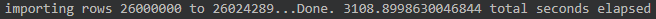
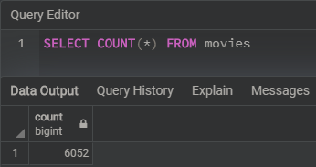
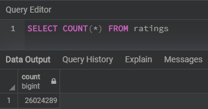

# Movies ETL

## Project Overview
Amazing Prime Video, a platform for streaming movies and tv shows would like to develop an algorithm to predict which low budget movies being released will become popular.
To inspire the team, have some fun, and connect with the local coding community, Amazing Prime decided to sponsor a hackathon. The hackathon participants will have to predict the popular pictures from a clean data set of movie data.

## Resources
Data Sources: movies_metadata.csv (Kaggle Metadata), ratings.csv (MovieLens rating data), wikipedia-movies.json(Wikipedia web scrape data)
Software: Python 3.7.7, Jupyter Notebook, PostgreSQL 11, pgAdmin 4
Dependencies: json, pandas, numpy, re, sqlalchemy, psycopg2, time

## Summary
We had to create an automated pipeline that takes in new data, performs the appropriate transformations, and loads the data into existing tables. This was achieved by performing the Extract, Transform, and Load (ETL) process on three data source files and then loading the cleaned data to a PostgreSQL database.

It took a total of 52 minutes to export the movie and ratings tables into the PostgreSQL database.

There was a total of 6,052 rows in the movies table.

 
There was a total of 26,024,289 rows in the ratings table.

